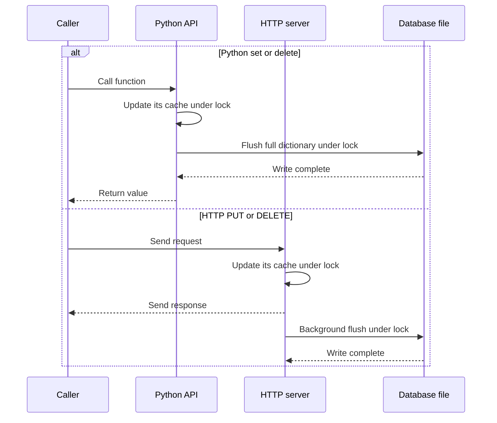

# Architecture

The application is currently intentionally small:

- `cache.py` provides a thread-safe in-memory dictionary backed by a JSON file.
- `api.py` provides the synchronous Python functions exported by `__init__.py`.
- `main.py` creates the FastAPI application and defines the HTTP routes.
- `run.py` starts the service with Uvicorn.

The Python API and HTTP service each create their own `Cache` instance. They do
not share in-memory updates, even within the same process. Each cache has its own
lock; separate caches and processes accessing the same file are not coordinated.
See [persistence](persistence.md) for the consequences.

## Loading and writes

The Python API loads its cache on first use; the HTTP server loads its cache at
startup. Both read from memory. Their successful write paths differ:

An HTTP success response does not confirm persistence. File writes do not
guarantee crash recovery; see [persistence limits](persistence.md#current-constraints).

## Error handling

Python callers receive application exceptions or file-access `OSError`s directly.
For HTTP, `error_handlers.py` translates application and HTTP exceptions into
[error responses](api.md#http-error-responses), with a generic `500` for unexpected
request errors. A background flush failure cannot change a response already sent.
File-access errors during the initial load prevent the HTTP server from starting.
